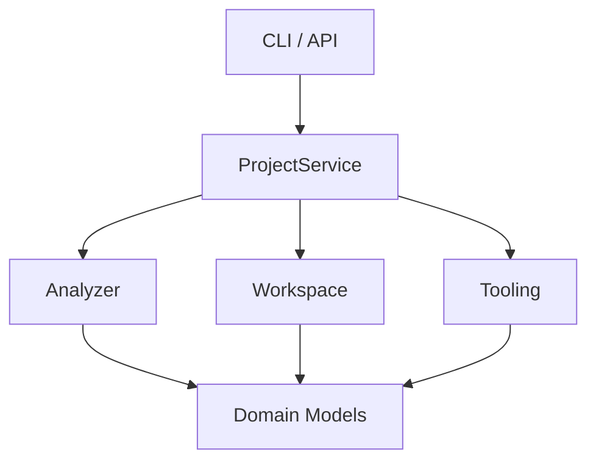

# DuolinGal 项目结构与运行流程

## 1. 这份文档是干什么的

这份文档不讨论“项目值不值得做”，也不讨论“未来可能支持哪些功能”。  

它只做两件事：

1. 带你快速看懂当前仓库结构。
2. 带你顺着一次真实运行链路，把代码怎么串起来讲清楚。

如果你第一次进入这个仓库，建议阅读顺序是：

1. [README.md](/D:/DuolinGal/DuolinGal/README.md)
2. [project-plan.zh-CN.md](/D:/DuolinGal/DuolinGal/docs/project-plan.zh-CN.md)
3. 当前这份文档
4. [feasibility.zh-CN.md](/D:/DuolinGal/DuolinGal/docs/feasibility.zh-CN.md)

## 2. 仓库结构总览

当前仓库结构很克制，主要分成 5 层：

```text
DuolinGal/
├─ apps/
│  ├─ api/
│  └─ web/
├─ configs/
├─ docs/
├─ src/duolingal/
│  ├─ api/
│  ├─ core/
│  ├─ domain/
│  └─ services/
└─ tests/
```

### `apps/`

- [apps/api/README.md](/D:/DuolinGal/DuolinGal/apps/api/README.md)
- [apps/web/README.md](/D:/DuolinGal/DuolinGal/apps/web/README.md)

这里现在只是预留位。

原因很明确：项目还没走到“需要完整前后端工程”的阶段，所以先用 `src/duolingal/api` 提供最小本地 API 即可，不急着把 `apps/api`、`apps/web` 铺成完整应用。

### `configs/`

- [toolchain.example.json](/D:/DuolinGal/DuolinGal/configs/toolchain.example.json)

这里放的是未来的工具链配置样例。  
当前还没有正式的配置读取逻辑，但配置结构已经先约定了：外部工具用显式路径接入，而不是默认被仓库内置。

### `docs/`

- [project-plan.zh-CN.md](/D:/DuolinGal/DuolinGal/docs/project-plan.zh-CN.md)
- [feasibility.zh-CN.md](/D:/DuolinGal/DuolinGal/docs/feasibility.zh-CN.md)
- 当前这份 [structure-and-runtime.zh-CN.md](/D:/DuolinGal/DuolinGal/docs/structure-and-runtime.zh-CN.md)

这是“项目脑图层”。  

你可以把它理解为：

- `project-plan` 负责讲我们准备做什么
- `feasibility` 负责讲这事到底靠不靠谱
- `structure-and-runtime` 负责讲现在代码是怎么跑起来的

### `src/duolingal/domain/`

- [models.py](/D:/DuolinGal/DuolinGal/src/duolingal/domain/models.py)

这是“数据契约层”。  

这一层定义：

- 分析结果长什么样
- 工作区清单长什么样
- 外部工具信息长什么样
- 原始脚本节点和对齐台词长什么样

它的职责是统一数据结构，不关心 CLI、API 或磁盘操作。

### `src/duolingal/core/`

- [analyzer.py](/D:/DuolinGal/DuolinGal/src/duolingal/core/analyzer.py)
- [workspace.py](/D:/DuolinGal/DuolinGal/src/duolingal/core/workspace.py)
- [tooling.py](/D:/DuolinGal/DuolinGal/src/duolingal/core/tooling.py)
- [aligner.py](/D:/DuolinGal/DuolinGal/src/duolingal/core/aligner.py)

这是“核心能力层”。  

目前的核心能力有 4 件：

- 分析游戏目录
- 初始化工作区
- 识别外部工具状态
- 提供最小对齐数据结构与 CSV 导出

### `src/duolingal/services/`

- [project_service.py](/D:/DuolinGal/DuolinGal/src/duolingal/services/project_service.py)

这是“编排层”。  

它本身不做复杂逻辑，只负责把 `core` 里的能力组合起来，供 CLI 和 API 调用。

### `src/duolingal/api/`

- [app.py](/D:/DuolinGal/DuolinGal/src/duolingal/api/app.py)

这是最小本地 API 层。  

它的定位不是“完整后端”，而是“以后给本地网页前端或桌面壳调用的薄接口”。

### `src/duolingal/cli.py`

- [cli.py](/D:/DuolinGal/DuolinGal/src/duolingal/cli.py)

这是当前最实用的入口。  

因为项目还在验证阶段，所以 CLI 比 UI 更重要。

### `tests/`

- [test_analyzer.py](/D:/DuolinGal/DuolinGal/tests/test_analyzer.py)
- [test_workspace.py](/D:/DuolinGal/DuolinGal/tests/test_workspace.py)
- [support.py](/D:/DuolinGal/DuolinGal/tests/support.py)

这里的测试不是面向完整业务流程，而是面向目前最核心的两条链路：

- 目录识别
- 工作区初始化

## 3. 当前最重要的代码文件

如果只看 6 个文件，建议看这 6 个：

1. [models.py](/D:/DuolinGal/DuolinGal/src/duolingal/domain/models.py)
2. [analyzer.py](/D:/DuolinGal/DuolinGal/src/duolingal/core/analyzer.py)
3. [workspace.py](/D:/DuolinGal/DuolinGal/src/duolingal/core/workspace.py)
4. [tooling.py](/D:/DuolinGal/DuolinGal/src/duolingal/core/tooling.py)
5. [project_service.py](/D:/DuolinGal/DuolinGal/src/duolingal/services/project_service.py)
6. [cli.py](/D:/DuolinGal/DuolinGal/src/duolingal/cli.py)

它们基本就代表了当前项目的主骨架。

## 4. 代码调用关系

当前的调用关系非常简单：



这套结构的好处是：

- 入口很薄
- 数据结构统一
- 核心逻辑集中
- 以后扩展 `extractor/parser/synth` 时不会太乱

## 5. 真实运行链路一：`analyze`

命令：

```powershell
$env:PYTHONPATH='src'
python -m duolingal analyze "D:\Games\SenrenBanka"
```

### 运行过程

1. Python 进入 [__main__.py](/D:/DuolinGal/DuolinGal/src/duolingal/__main__.py)
2. 转到 [cli.py](/D:/DuolinGal/DuolinGal/src/duolingal/cli.py#L9)
3. `argparse` 识别出子命令 `analyze`
4. CLI 调用 [ProjectService.analyze()](/D:/DuolinGal/DuolinGal/src/duolingal/services/project_service.py#L12)
5. Service 再调用 [analyze_game_directory()](/D:/DuolinGal/DuolinGal/src/duolingal/core/analyzer.py#L38)
6. Analyzer 扫描目录，收集 `.xp3`、`.dll`、`.exe`
7. Analyzer 把扫描结果封装成 [GameAnalysis](/D:/DuolinGal/DuolinGal/src/duolingal/domain/models.py#L33)
8. CLI 把结果作为 JSON 输出到终端

### `analyze_game_directory()` 具体做了什么

在 [analyzer.py](/D:/DuolinGal/DuolinGal/src/duolingal/core/analyzer.py#L38) 里，当前流程是：

- 解析并标准化输入路径
- 用 `_scan_files()` 扫描前几层文件
- 收集资源包、DLL、EXE
- 做大小写归一
- 用 `_match_known_game()` 判断是否命中已知游戏指纹
- 输出 `supported / confidence / warnings / notes`

### 为什么这一步重要

因为 DuolinGal 不是“拿到任意路径就直接开始解包”。  

它先做的是：

- 这是不是我们当前支持的作品
- 有哪些关键包
- 关键 DLL 是否存在
- 后续工作区初始化是否有必要继续

这是一个很典型的“先验证，再推进”的设计。

## 6. 真实运行链路二：`init-project`

命令：

```powershell
$env:PYTHONPATH='src'
python -m duolingal init-project "D:\Games\SenrenBanka" --project-id senren-banka
```

### 运行过程

1. CLI 识别 `init-project`
2. 调用 [ProjectService.init_project()](/D:/DuolinGal/DuolinGal/src/duolingal/services/project_service.py#L15)
3. Service 先执行一次 `analyze`
4. 再调用 [initialize_project_workspace()](/D:/DuolinGal/DuolinGal/src/duolingal/core/workspace.py#L12)
5. 工作区目录被创建
6. `project_manifest.json` 和 `directory_snapshot.json` 被写入
7. CLI 输出最终的 `ProjectManifest`

### 为什么要先分析再初始化

因为 `init-project` 不是盲目创建文件夹。  

它的逻辑是：

- 先证明这个目录值得初始化
- 再把“已经确认过的事实”写进 manifest

这个拆分后面很有用：

- 如果你只想分析目录，可以只跑 `analyze`
- 如果你已经分析通过，再跑 `init-project`
- 将来 UI 里也可以先显示分析结果，再让用户点“初始化项目”

## 7. 真实运行链路三：`list-tools`

命令：

```powershell
$env:PYTHONPATH='src'
python -m duolingal list-tools
```

### 运行过程

1. CLI 调用 [ProjectService.list_tools()](/D:/DuolinGal/DuolinGal/src/duolingal/services/project_service.py#L19)
2. Service 调用 [resolve_tooling_status()](/D:/DuolinGal/DuolinGal/src/duolingal/core/tooling.py#L53)
3. Tooling 遍历 `KNOWN_TOOLS`
4. 用 `which()` 探测工具是否在当前环境可见
5. 输出 `ToolRequirement[]`

### 这里有个设计点

在 [tooling.py](/D:/DuolinGal/DuolinGal/src/duolingal/core/tooling.py#L75)，我把工具状态分成了：

- `found`
- `missing`
- `not_checked`

原因是像 `GPT-SoVITS` 这种当前还没正式接入的工具，如果直接显示成 `missing`，会误导人觉得“项目现在就要求你装它”。  

所以对于 `planned` 工具，当前状态更适合是 `not_checked`。

## 8. API 运行链路

如果你安装了 API 依赖：

```powershell
pip install -e .[api]
$env:PYTHONPATH='src'
uvicorn duolingal.api.app:create_app --factory --reload
```

### `create_app()` 在做什么

入口在 [app.py](/D:/DuolinGal/DuolinGal/src/duolingal/api/app.py#L13)。

流程是：

1. 检查 `fastapi` 是否安装
2. 创建 `ProjectService`
3. 注册 3 个核心接口：
   - `/health`
   - `/api/tools`
   - `/api/analyze`
   - `/api/projects/init`

这里的 API 很薄，这是故意的。  

现在还没必要把“调工具、跑任务、写日志、做队列”都塞进 API 层。

## 9. 工作区初始化后会产生什么

默认工作区根目录来自 [config.py](/D:/DuolinGal/DuolinGal/src/duolingal/config.py)：

- `workspace/`
- `workspace/projects/`

单个项目目录下会生成：

```text
workspace/projects/<project_id>/
├─ raw_assets/
├─ extracted_voice/
├─ extracted_script/
├─ dataset/
├─ models/
├─ generated_voice/
├─ release/
├─ logs/
├─ project_manifest.json
└─ directory_snapshot.json
```

其中：

- `project_manifest.json` 是“这个项目是什么”
- `directory_snapshot.json` 是“初始化当时看到了什么”

这两个文件以后都很重要：

- 前者用于业务流程
- 后者用于调试和回溯

## 10. 当前 `aligner` 处于什么状态

`aligner` 还不是完整的 SCN/PSB 对齐器，目前只是最小骨架：

- 输入 [RawScriptNode](/D:/DuolinGal/DuolinGal/src/duolingal/domain/models.py#L88)
- 输出 [AlignedLine](/D:/DuolinGal/DuolinGal/src/duolingal/domain/models.py#L99)
- 支持导出 CSV

也就是说，当前它做的不是“自动把《千恋万花》全量对齐好”，而是：

**先把未来真正的对齐结果结构定义清楚。**

这是当前项目很诚实的一点。

## 11. 当前测试覆盖了什么

### [test_analyzer.py](/D:/DuolinGal/DuolinGal/tests/test_analyzer.py)

覆盖：

- 典型《千恋万花》目录布局能否被识别
- 文件名大小写不同的情况下能否识别
- 缺少 `voice.xp3` / `scn.xp3` 时是否给出正确 warning

### [test_workspace.py](/D:/DuolinGal/DuolinGal/tests/test_workspace.py)

覆盖：

- 分析通过后能否创建工作区
- `project_manifest.json` 和 `directory_snapshot.json` 是否成功写入

### [support.py](/D:/DuolinGal/DuolinGal/tests/support.py)

提供：

- 测试时的临时工作区
- `touch()` 辅助函数
- `src` 路径注入

## 12. 我觉得当前设计为什么是合理的

### 1. 现在没有过度工程化

没有先上复杂的依赖注入、事件系统、任务队列、数据库层。  

这对当前阶段是好事，因为我们首先要验证的是“链路存在”，不是“架构炫技”。

### 2. 核心逻辑和入口是分开的

CLI 和 API 都不直接操作底层逻辑，而是通过 `ProjectService`。  

这意味着以后你加 Web UI 时，不需要重写一套业务逻辑。

### 3. 数据模型先于具体工具实现

`GameAnalysis / ProjectManifest / RawScriptNode / AlignedLine` 这些结构先定下来，以后换工具也不至于整个工程抖动太大。

## 13. 当前仍然缺什么

现在最关键但还没进代码的，是下面这些：

- 外部工具执行器
- XP3 解包流水线
- SCN / PSB 中间层解析器
- `lines.csv` 的真实构建逻辑
- GPT-SoVITS 接入
- 补丁封包与回注

所以你可以把现在这版理解成：

**“能够稳定起步的工程骨架”，而不是“已经在做完整业务”的系统。**

## 14. 接下来最值得看的代码顺序

如果你准备继续深读代码，我建议顺序是：

1. [models.py](/D:/DuolinGal/DuolinGal/src/duolingal/domain/models.py)
2. [analyzer.py](/D:/DuolinGal/DuolinGal/src/duolingal/core/analyzer.py)
3. [workspace.py](/D:/DuolinGal/DuolinGal/src/duolingal/core/workspace.py)
4. [tooling.py](/D:/DuolinGal/DuolinGal/src/duolingal/core/tooling.py)
5. [project_service.py](/D:/DuolinGal/DuolinGal/src/duolingal/services/project_service.py)
6. [cli.py](/D:/DuolinGal/DuolinGal/src/duolingal/cli.py)
7. [app.py](/D:/DuolinGal/DuolinGal/src/duolingal/api/app.py)

## 15. 一句话总结

DuolinGal 当前代码的核心价值，不在于“已经实现了多少 fancy 功能”，而在于：

**它已经把项目最应该先稳定下来的那部分骨架，拆分得比较清楚了。**
