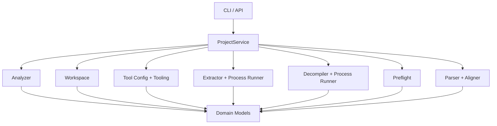

# DuolinGal 项目结构与运行流程

这份文档只回答两件事：

1. 当前仓库是怎么组织的
2. `analyze -> init-project -> preflight -> extract -> decompile-scripts -> build-lines` 这条链路是怎么跑起来的

它不负责论证项目值不值得做。那部分请看 [feasibility.zh-CN.md](./feasibility.zh-CN.md) 和 [project-plan.zh-CN.md](./project-plan.zh-CN.md)。

## 1. 仓库结构总览

```text
DuolinGal/
|-- apps/
|   |-- api/
|   `-- web/
|-- configs/
|   `-- toolchain.example.json
|-- docs/
|   |-- feasibility.zh-CN.md
|   |-- local-validation-checklist.zh-CN.md
|   |-- project-plan.zh-CN.md
|   `-- structure-and-runtime.zh-CN.md
|-- src/duolingal/
|   |-- api/
|   |   `-- app.py
|   |-- core/
|   |   |-- aligner.py
|   |   |-- analyzer.py
|   |   |-- decompiler.py
|   |   |-- extractor.py
|   |   |-- parser.py
|   |   |-- preflight.py
|   |   |-- process_runner.py
|   |   |-- tool_config.py
|   |   |-- tooling.py
|   |   `-- workspace.py
|   |-- domain/
|   |   `-- models.py
|   |-- services/
|   |   `-- project_service.py
|   |-- __main__.py
|   `-- cli.py
`-- tests/
```

## 2. 分层职责

### `domain`

核心数据模型层，负责定义统一的数据契约：

- `GameAnalysis`
- `ProjectManifest`
- `ToolRequirement`
- `ExtractionResult`
- `ScriptDecompileResult`
- `PreflightReport`
- `RawScriptNode`
- `AlignedLine`
- `LinesBuildResult`

### `core`

当前最关键的业务能力都在这里：

- `analyzer.py`
  负责扫描游戏目录并判断是否命中当前支持的游戏指纹
- `workspace.py`
  负责初始化工作区并写出 `project_manifest.json`
- `tool_config.py`
  负责读取 `toolchain.local.json`
- `tooling.py`
  负责探测工具状态并输出统一的 `ToolRequirement`
- `process_runner.py`
  负责执行外部命令并记录标准化结果
- `extractor.py`
  负责提取 `voice.xp3`、`scn.xp3`
- `decompiler.py`
  负责把 `.scn`、`.psb`、`.psb.m` 反编译成 JSON
- `preflight.py`
  负责判断当前项目是否具备运行下一阶段的条件，并给出推荐命令
- `parser.py`
  负责遍历脚本 JSON，提取 `RawScriptNode` 并导出 `lines.csv`
- `aligner.py`
  负责把原始节点转成当前阶段可用的对齐表

### `services`

`project_service.py` 是编排层。它自己不做复杂逻辑，只把 `core` 里的能力组织成对上层友好的入口。

### `api`

`app.py` 是最小本地 API。它不是完整后端，只是为了让后续本地 Web UI 有一个稳定调用面。

### `cli`

`cli.py` 是当前最实用的入口。项目现在仍处于“验证链路”的阶段，所以 CLI 比 UI 更重要。

## 3. 最重要的代码文件

如果你准备快速读懂当前项目，建议先看这 10 个文件：

1. [models.py](../src/duolingal/domain/models.py)
2. [analyzer.py](../src/duolingal/core/analyzer.py)
3. [workspace.py](../src/duolingal/core/workspace.py)
4. [tool_config.py](../src/duolingal/core/tool_config.py)
5. [process_runner.py](../src/duolingal/core/process_runner.py)
6. [extractor.py](../src/duolingal/core/extractor.py)
7. [decompiler.py](../src/duolingal/core/decompiler.py)
8. [preflight.py](../src/duolingal/core/preflight.py)
9. [parser.py](../src/duolingal/core/parser.py)
10. [project_service.py](../src/duolingal/services/project_service.py)

## 4. 调用关系



## 5. 真实运行链路

### 5.1 `analyze`

命令：

```powershell
$env:PYTHONPATH='src'
python -m duolingal analyze "D:\Games\SenrenBanka"
```

做的事情：

1. `cli.py` 解析命令
2. `ProjectService.analyze()` 调用 `analyze_game_directory()`
3. `analyzer.py` 扫描目录中的 `.xp3`、`.dll`、`.exe`
4. 和已知游戏指纹比对
5. 输出 `GameAnalysis`

### 5.2 `init-project`

命令：

```powershell
python -m duolingal init-project "D:\Games\SenrenBanka" --project-id senren-banka
```

做的事情：

1. 先再次执行 `analyze`
2. `workspace.py` 创建标准目录
3. 写出 `project_manifest.json`
4. 写出 `directory_snapshot.json`

初始化后的目录大致如下：

```text
workspace/projects/senren-banka/
|-- raw_assets/
|-- extracted_voice/
|-- extracted_script/
|-- decompiled_script/
|-- dataset/
|-- models/
|-- generated_voice/
|-- release/
|-- logs/
|-- project_manifest.json
`-- directory_snapshot.json
```

### 5.3 `preflight`

命令：

```powershell
python -m duolingal preflight "D:\DuolinGal\DuolinGal\workspace\projects\senren-banka" --config configs/toolchain.local.json
```

做的事情：

1. 读取 `project_manifest.json`
2. 读取工具链配置
3. 按目标阶段检查：
   - 游戏目录和资源包是否存在
   - `KrkrExtract` / `FreeMote` 是否配置完整
   - `extracted_script` 下是否有 `.scn/.psb/.psb.m`
   - `decompiled_script` 或 `extracted_script` 下是否已有 JSON
4. 生成结构化报告
5. 给出当前最推荐执行的下一条命令

### 5.4 `extract`

命令：

```powershell
python -m duolingal extract "D:\DuolinGal\DuolinGal\workspace\projects\senren-banka" --config configs/toolchain.local.json
```

做的事情：

1. 读取 `project_manifest.json`
2. 从工具链配置里找到 `krkrextract`
3. 用参数模板渲染实际命令
4. 调用 `process_runner.py` 执行外部工具
5. 将 `voice.xp3` 输出到 `extracted_voice/`
6. 将 `scn.xp3` 输出到 `extracted_script/`
7. 把每次提取的计划与运行结果写入 `logs/extract-*.json`

模板变量：

- `{package}`
- `{output}`
- `{workspace}`

### 5.5 `decompile-scripts`

命令：

```powershell
python -m duolingal decompile-scripts "D:\DuolinGal\DuolinGal\workspace\projects\senren-banka" --config configs/toolchain.local.json
```

做的事情：

1. 遍历 `extracted_script/` 下的 `.scn`、`.psb`、`.psb.m`
2. 从工具链配置里找到 `freemote`
3. 用参数模板渲染实际命令
4. 调用 `process_runner.py` 逐个反编译脚本文件
5. 将 JSON 输出到 `decompiled_script/`
6. 把每次反编译的计划与运行结果写入 `logs/decompile-*.json`

模板变量：

- `{input}`
- `{output}`
- `{workspace}`

### 5.6 `build-lines`

命令：

```powershell
python -m duolingal build-lines "D:\DuolinGal\DuolinGal\workspace\projects\senren-banka"
```

做的事情：

1. 默认优先读取 `decompiled_script/`
2. 如果没有可解析 JSON，再退回到 `extracted_script/`
3. 递归查找看起来像对话节点的字典结构
4. 尽量提取：
   - `speaker_name`
   - `voice_file`
   - `jp_text`
   - `en_text`
5. 写出 `dataset/script_nodes.jsonl`
6. 通过 `aligner.py` 生成 `dataset/lines.csv`

当前解析器仍然是“中间层骨架”，不是完整的 SCN/PSB 语义恢复器。它的目标是先证明：我们能把脚本 JSON 变成可审查的训练/合成数据表。

## 6. API 运行链路

启动：

```powershell
pip install -e .[api]
$env:PYTHONPATH='src'
uvicorn duolingal.api.app:create_app --factory --reload
```

当前 API：

- `GET /health`
- `GET /api/tools`
- `POST /api/analyze`
- `POST /api/projects/init`
- `POST /api/projects/extract`
- `POST /api/projects/decompile-scripts`
- `POST /api/projects/preflight`
- `POST /api/projects/build-lines`

## 7. 当前测试覆盖

当前测试已经覆盖到这些部分：

- 目录识别
- 工作区初始化
- 工具链配置读取
- 命令执行封装
- XP3 提取骨架
- 脚本反编译骨架
- 项目预检报告
- 脚本 JSON 解析
- CLI 级的 `preflight`、`extract`、`decompile-scripts`、`build-lines`

运行命令：

```powershell
python -m unittest discover -s tests
```

## 8. 现在还缺什么

当前版本已经有“可验证闭环”，但还远不是完整产品。最关键的缺口仍然是：

- 真实的 FreeMote/SCN-PSB 参数适配与实机验证
- 文本与语音的高精度对齐
- FFmpeg 音频处理流水线
- GPT-SoVITS 训练与推理接入
- 补丁封包与回注验证

如果你准备开始做本机实测，请直接看 [local-validation-checklist.zh-CN.md](./local-validation-checklist.zh-CN.md)。
