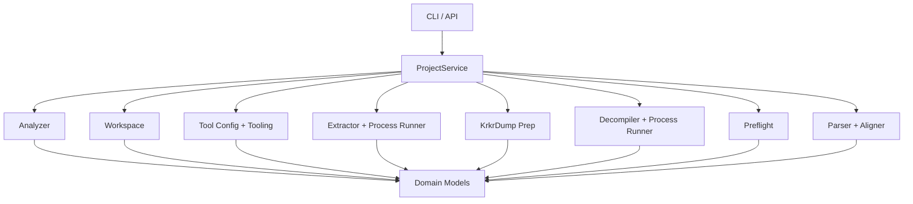

# DuolinGal 项目结构与运行流程

这份文档回答两件事：

1. 仓库现在怎么组织
2. `analyze -> init-project -> preflight -> prepare-krkrdump/extract -> decompile-scripts -> build-lines` 这条链路怎么运行

## 1. 仓库结构

```text
DuolinGal/
|-- apps/
|-- configs/
|   `-- toolchain.example.json
|-- docs/
|-- src/duolingal/
|   |-- api/
|   |-- core/
|   |-- domain/
|   `-- services/
`-- tests/
```

## 2. 分层职责

### `domain`

统一数据模型：

- `GameAnalysis`
- `ProjectManifest`
- `ToolRequirement`
- `ExtractionResult`
- `ScriptDecompileResult`
- `KrkrDumpPreparationResult`
- `PreflightReport`
- `RawScriptNode`
- `AlignedLine`
- `LinesBuildResult`

### `core`

主要业务能力都在这里：

- `analyzer.py`
  扫描游戏目录并匹配当前支持的游戏指纹
- `workspace.py`
  初始化工作区并写出 `project_manifest.json`
- `tool_config.py`
  读取 `toolchain.local.json`
- `tooling.py`
  汇总工具状态
- `process_runner.py`
  执行外部命令并收集标准化结果
- `extractor.py`
  处理离线 XP3 提取
- `krkrdump.py`
  生成 `KrkrDump.json` 并输出本机启动命令
- `decompiler.py`
  用 FreeMote 把 `.scn/.psb/.psb.m` 转成 JSON
- `preflight.py`
  判断当前项目下一步该执行什么
- `parser.py`
  从脚本 JSON 提取节点并导出 `lines.csv`
- `aligner.py`
  把原始节点整理成训练或合成可用的数据行

### `services`

`project_service.py` 负责把 `core` 层能力编排成 CLI 和 API 可直接调用的入口。

### `api`

`app.py` 提供最小本地 API，方便以后接 Web UI。

### `cli`

`cli.py` 是当前最实用的入口，优先用于真实链路验证。

## 3. 重要文件

建议先看这几份代码：

1. [models.py](../src/duolingal/domain/models.py)
2. [analyzer.py](../src/duolingal/core/analyzer.py)
3. [workspace.py](../src/duolingal/core/workspace.py)
4. [krkrdump.py](../src/duolingal/core/krkrdump.py)
5. [preflight.py](../src/duolingal/core/preflight.py)
6. [decompiler.py](../src/duolingal/core/decompiler.py)
7. [parser.py](../src/duolingal/core/parser.py)
8. [project_service.py](../src/duolingal/services/project_service.py)

## 4. 调用关系



## 5. 实际运行流程

### 5.1 `analyze`

```powershell
$env:PYTHONPATH='src'
python -m duolingal analyze "<GAME_DIR>"
```

它会扫描目录里的 `.xp3`、`.dll`、`.exe`，并输出 `GameAnalysis`。

### 5.2 `init-project`

```powershell
python -m duolingal init-project "<GAME_DIR>" --project-id senren-banka
```

它会创建标准工作区，写出：

- `project_manifest.json`
- `directory_snapshot.json`

同时把主程序名存进 `primary_executable`，供 `KrkrDump` 使用。

### 5.3 `preflight`

```powershell
python -m duolingal preflight "<PROJECT_ROOT>" --config configs/toolchain.local.json
```

它会检查：

- 游戏目录和关键资源包是否存在
- `KrkrDump` 是否同时具备 `KrkrDumpLoader.exe`、`KrkrDump.dll` 和游戏 exe
- `KrkrExtract` 是否可作为离线备用
- `FreeMote` 是否具备可用参数模板
- `extracted_script/` 是否已有脚本资源
- `decompiled_script/` 是否已有 JSON

最后给出下一条最值得执行的命令。

### 5.4 `prepare-krkrdump`

```powershell
python -m duolingal prepare-krkrdump "<PROJECT_ROOT>" --config configs/toolchain.local.json
```

它会：

1. 读取项目清单
2. 找到 `KrkrDumpLoader.exe`
3. 检查同目录下是否有 `KrkrDump.dll`
4. 生成脚本优先的 `KrkrDump.json`
5. 输出一条本机启动命令

注意：这一步不会在仓库里代替你运行注入式 dump，它只做准备工作。

### 5.5 `extract`

```powershell
python -m duolingal extract "<PROJECT_ROOT>" --config configs/toolchain.local.json
```

这是保留的离线 XP3 方案。只有当你手头的 `KrkrExtract` 版本真的支持稳定 CLI 时，这条路才值得用。

### 5.6 `decompile-scripts`

```powershell
python -m duolingal decompile-scripts "<PROJECT_ROOT>" --config configs/toolchain.local.json
```

它会遍历脚本资源，并调用 `FreeMote` 把它们转成 JSON。

### 5.7 `build-lines`

```powershell
python -m duolingal build-lines "<PROJECT_ROOT>"
```

它会优先读取 `decompiled_script/`，再退回 `extracted_script/`，然后导出：

- `dataset/script_nodes.jsonl`
- `dataset/lines.csv`

## 6. API

启动方式：

```powershell
pip install -e .[api]
$env:PYTHONPATH='src'
uvicorn duolingal.api.app:create_app --factory --reload
```

当前接口：

- `GET /health`
- `GET /api/tools`
- `POST /api/analyze`
- `POST /api/projects/init`
- `POST /api/projects/extract`
- `POST /api/projects/prepare-krkrdump`
- `POST /api/projects/decompile-scripts`
- `POST /api/projects/preflight`
- `POST /api/projects/build-lines`

## 7. 当前还缺什么

离目标最近但还没落地的部分有：

- 真实 `KrkrDump` 参数与输出验证
- 真实 `FreeMote` 反编译验证
- `lines.csv` 的对齐质量提升
- 回注补丁与音频链路验证
- TTS 训练与推理接入
